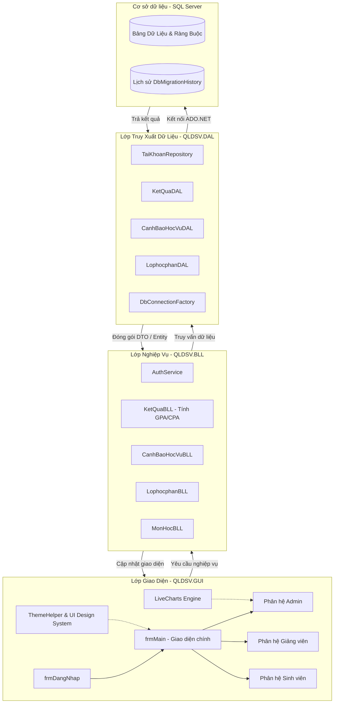

# 🎓 HỆ THỐNG QUẢN LÝ ĐIỂM SINH VIÊN (.NET)
> **Dự án Lập trình .NET (WinForms) | Nhóm 6 — Học viện Ngân hàng (B.A)**
> Một giải pháp quản lý đào tạo, điểm số, đăng ký học phần và theo dõi học tập toàn diện cho Nhà trường, Giảng viên và Sinh viên.

---

<p align="center">
  
  
  
  
  
</p>

---

## 📖 1. Giới thiệu dự án

Hệ thống **Quản lý Điểm Sinh viên** được phát triển bởi **Nhóm 6** trong khuôn khổ học phần **Lập trình .NET tại Học viện Ngân hàng**. Dự án hướng tới việc tối ưu hóa quy trình quản lý kết quả học tập, đăng ký học phần, đánh giá rèn luyện và theo dõi cảnh báo học vụ của sinh viên một cách trực quan, chính xác và đồng bộ. 

Hệ thống giải quyết triệt để các vấn đề của cách quản lý truyền thống bằng cách tin học hóa toàn bộ quy trình phối hợp giữa ba đối tượng chính: **Ban Quản trị (Admin)**, **Giảng viên** và **Sinh viên**. 

Dự án áp dụng các chuẩn thiết kế giao diện hiện đại (Modern UX/UI) cùng các kiến trúc phần mềm tiêu chuẩn để mang lại trải nghiệm mượt mà, chuyên nghiệp nhất.

---

## ✨ 2. Các tính năng cốt lõi (Key Features)

Hệ thống phân quyền truy cập nghiêm ngặt dựa trên vai trò người dùng (Role-based Access Control - RBAC) với các tập tính năng chuyên biệt:

### 🛡️ Phân hệ Quản trị viên (Admin Portal)
* **Tổng quan & Dashboard thống kê:** Tích hợp hệ thống biểu đồ thông minh (**LiveCharts**) hiển thị trực quan tỷ lệ xếp loại học tập, số lượng sinh viên theo khoa, và biến động học tập.
* **Quản lý Đào tạo & Nhân sự:**
  * Quản lý Khoa/Viện, thông tin hồ sơ Giảng viên và Lớp niên chế.
  * Quản lý thông tin chi tiết Sinh viên (Hồ sơ cá nhân, lớp sinh hoạt, niên khóa).
  * Quản lý danh mục Môn học, số tín chỉ và cơ cấu điểm thành phần.
* **Quản lý Lớp học phần & Đăng ký:** Thiết lập các lớp học phần, phân công giảng dạy cho giảng viên và mở cổng đăng ký học phần cho sinh viên.
* **Hệ thống Cảnh báo Học vụ:** Tự động lọc và đưa ra danh sách cảnh báo học vụ đối với các sinh viên có điểm trung bình tích lũy (GPA) dưới ngưỡng an toàn hoặc vi phạm số tín chỉ tích lũy.
* **Quản trị Tài khoản:** Cấp phát tài khoản mới, phân quyền (Admin / Giảng viên / Sinh viên) và quản lý trạng thái tài khoản.
* **Quản lý Phúc khảo:** Tiếp nhận đơn phúc khảo điểm số từ sinh viên, chuyển thông tin đến giảng viên bộ môn và cập nhật trạng thái xử lý đơn.

### 👨‍🏫 Phân hệ Giảng viên (Lecturer Portal)
* **Quản lý Giảng dạy:** Xem danh sách các Lớp học phần được phân công trực tiếp trong học kỳ.
* **Nhập & Quản lý Điểm số:** 
  * Giao diện nhập điểm thông minh hỗ trợ tự động tính điểm tổng kết dựa trên công thức tỷ lệ điểm thành phần của môn học (ví dụ: Chuyên cần 10%, Kiểm tra 1 15%, Kiểm tra 2 15%, Cuối kỳ 60%).
  * Hỗ trợ xuất danh sách lớp ra file Excel hoặc nhập điểm hàng loạt từ file Excel (**ClosedXML** / **EPPlus**).
* **Tra cứu nâng cao:** Tìm kiếm nhanh sinh viên theo mã số, họ tên trong các lớp học phần mình phụ trách.
* **Xử lý Phúc khảo:** Xem các yêu cầu phúc khảo điểm số từ sinh viên lớp mình dạy và thực hiện cập nhật điểm sau khi chấm lại.

### 🎓 Phân hệ Sinh viên (Student Portal)
* **Xem kết quả học tập:** Tra cứu bảng điểm chi tiết theo từng học kỳ, năm học. Tự động tính điểm trung bình học kỳ (GPA) và tích lũy (CPA) theo thang điểm 4 và thang điểm 10.
* **Đăng ký học phần trực tuyến:** Xem danh sách các lớp học phần đang mở, đăng ký hoặc hủy lớp học phần theo nguyện vọng và kiểm tra lịch học cá nhân.
* **Yêu cầu phúc khảo điểm:** Gửi đơn phúc khảo trực tuyến cho các môn học có điểm số chưa chính xác kèm theo lý do cụ thể.
* **Theo dõi cảnh báo học tập:** Nhận thông báo sớm nếu rơi vào danh sách cảnh báo học tập để có phương án cải thiện kết quả.

---

## 🏗️ 3. Kiến trúc hệ thống (Overall Architecture)

Dự án được xây dựng theo mô hình **Kiến trúc 3 lớp (3-Layer Architecture)** chuẩn mực của các ứng dụng Windows Forms lớn. Kiến trúc này giúp tách biệt rõ ràng các nhiệm vụ hiển thị giao diện, xử lý nghiệp vụ và truy xuất cơ sở dữ liệu.

### Sơ đồ luồng dữ liệu kiến trúc


### Các nguyên tắc thiết kế cốt lõi
1. **Repository Pattern (Mẫu Repository):** Toàn bộ các thao tác với thực thể dữ liệu được trừu tượng hóa qua các Repository lớp DAL (ví dụ: `ITaiKhoanRepository`), giúp dễ dàng kiểm thử và thay đổi nguồn dữ liệu.
2. **Dependency Injection & Service Locator:** Ứng dụng triển khai một `ServiceLocator` tập trung nhằm khởi tạo các lớp DAL, BLL và truyền chuỗi kết nối tự động từ cấu hình hệ thống, tránh việc khởi tạo thủ công phân tán.
3. **Mã hóa bảo mật:** Sử dụng cơ chế băm mật khẩu (Hashing) bảo mật, chống rò rỉ dữ liệu tài khoản người dùng.
4. **Tham số hóa truy vấn (Parameterized Queries):** Tuyệt đối không ghép chuỗi SQL trực tiếp khi truy vấn dữ liệu. Tất cả các lệnh gửi lên SQL Server đều sử dụng các tham số (`SqlParameter`) nhằm ngăn chặn triệt để lỗ hổng tấn công **SQL Injection**.
5. **Thiết kế UI đồng bộ:** Tận dụng thư viện **Guna.UI2** và **Krypton Toolkit** kết hợp cùng hệ thống `ThemeHelper` động để tùy biến màu sắc, bo tròn góc, và tối ưu hóa phản hồi giao diện khi co giãn màn hình (Responsive Shell Pattern).

---

## 🛠️ 4. Hướng dẫn cài đặt (Installation)

Để triển khai dự án trên môi trường cục bộ, vui lòng chuẩn bị đầy đủ các công cụ và thực hiện theo hướng dẫn sau.

### 📋 Yêu cầu hệ thống
* **Hệ điều hành:** Windows 10 / 11.
* **Môi trường phát triển:** Microsoft Visual Studio 2022 (khuyên dùng bản Community hoặc Enterprise).
* **Phiên bản .NET:** .NET Framework 4.8 SDK.
* **Cơ sở dữ liệu:** Microsoft SQL Server 2019 hoặc mới hơn (SQL Server Express là đủ).
* **Công cụ quản lý DB:** SQL Server Management Studio (SSMS).

### 🚀 Các bước cài đặt chi tiết

#### Bước 1: Tải mã nguồn về máy
Sao chép liên kết kho lưu trữ và thực hiện lệnh clone bằng Git:
```bash
git clone https://github.com/Le-Linh2859/Nhom6_HeThongQuanLiDiemSinhVien.git
```

#### Bước 2: Thiết lập Cơ sở dữ liệu (Database Migration)
Dự án được tích hợp sẵn hệ thống Database Migration tự động qua file batch.

1. Khởi động **SQL Server** trên máy tính của bạn.
2. Xác định tên Server của SQL Server (Ví dụ: `ADMIN-PC\QUYNHANH` hoặc `DESKTOP-1MI6150` hoặc đơn giản là `.` nếu dùng LocalDB).
3. Mở Command Prompt (cmd) và di chuyển vào thư mục dự án chứa thư mục `Database`.
4. Chạy file script migration với tham số là tên SQL Server của bạn:
   ```cmd
   cd HT_QLDSV/Database
   migrate.bat DESKTOP-1MI6150
   ```
   *(Hệ thống sẽ tự động quét thư mục `Database/Migrations`, tạo Database `DB_QLDiemSinhVien` và thực thi các script SQL theo thứ tự chuẩn xác).*
5. **Chạy dữ liệu mẫu (Seed Data):**
   Mở SQL Server Management Studio (SSMS), kết nối tới cơ sở dữ liệu và thực thi file `SQL insert sinhvien.sql` nằm ở thư mục gốc của dự án để nạp toàn bộ danh sách Khoa, Giảng viên, Sinh viên, Môn học, Học phần và Lịch học mẫu.

---

## 🏃 5. Hướng dẫn chạy dự án (Running the Project)

### Các bước khởi chạy trên Visual Studio
1. Mở Visual Studio 2022.
2. Chọn **Open a project or solution** và tìm tới file giải pháp của dự án:
   `HT_QLDSV/HT_QLDSV.slnx` hoặc `HT_QLDSV.sln`.
3. Nhấp chuột phải vào dự án giao diện `QLDSV.GUI` trong Solution Explorer và chọn **Set as Startup Project**.
4. Thực hiện Restore NuGet Packages: Vào menu **Tools** > **NuGet Package Manager** > **Package Manager Console** và chạy lệnh:
   ```powershell
   Update-Package -reinstall
   ```
5. Nhấn nút **Start (F5)** trên thanh công cụ để biên dịch và khởi chạy chương trình.

### 🔑 Danh sách tài khoản thử nghiệm (Seed Credentials)
Bạn có thể sử dụng các tài khoản mẫu dưới đây được tạo sẵn trong cơ sở dữ liệu để đăng nhập vào các phân hệ tương ứng:

| Vai trò | Tên đăng nhập | Mật khẩu | Chức năng kiểm thử |
| :--- | :--- | :--- | :--- |
| **Quản trị viên (Admin)** | `Admin2025` | `Admin123@` | Quản lý toàn bộ hệ thống, xem dashboard biểu đồ, thiết lập lớp học phần, duyệt đơn phúc khảo. |
| **Giảng viên** | `GV20260001` | `Giangvien01@` | Quản lý lớp học phần được phân công, nhập điểm sinh viên, cập nhật điểm phúc khảo. |
| **Sinh viên** | `SV20260001` | `Sinhvien01@` | Xem bảng điểm học tập cá nhân, đăng ký học phần trực tuyến, gửi đơn phúc khảo điểm. |

---

## ⚙️ 6. Cấu hình môi trường (Env Configuration)

Hệ thống quản lý chuỗi kết nối tập trung trong tệp cấu hình của phân hệ GUI. Bạn cần cập nhật thông tin máy chủ SQL Server của bạn tại đây để ứng dụng có thể kết nối được CSDL.

1. Tìm và mở file [App.config](file:///d:/L%E1%BA%ACP%20TR%C3%8CNH%20.NET/Nhom6_HeThongQuanLiDiemSinhVien/HT_QLDSV/QLDSV.GUI/App.config).
2. Tìm thẻ `<connectionStrings>` và chỉnh sửa thuộc tính `connectionString` tương ứng với máy chủ của bạn:
   ```xml
   <connectionStrings>
       <!-- Thay đổi DESKTOP-1MI6150 bằng tên SQL Server trên máy của bạn -->
       <add name="QLDSV" 
            connectionString="Data Source=YOUR_SERVER_NAME;Initial Catalog=DB_QLDiemSinhVien;Integrated Security=True;Encrypt=False" 
            providerName="System.Data.SqlClient" />
   </connectionStrings>
   ```
3. Lưu file và chạy lại chương trình.

---

## 📁 7. Cấu trúc thư mục (Folder Structure)

Dự án được phân chia theo cấu trúc Module hóa rõ ràng, dễ dàng cho việc phát triển và bảo trì lâu dài:

```text
Nhom6_HeThongQuanLiDiemSinhVien/
├── HT_QLDSV/
│   ├── Database/                   # Module quản lý cơ sở dữ liệu
│   │   ├── Migrations/             # Các tệp script SQL nâng cấp DB theo phiên bản
│   │   │   ├── V001__InitialSchema.sql
│   │   │   └── V002__AddMigrationTracking.sql
│   │   ├── migrate.bat             # File thực thi migration tự động
│   │   └── README.md               # Hướng dẫn chi tiết sử dụng migration
│   │
│   ├── QLDSV.DAL/                  # Data Access Layer (Truy cập dữ liệu)
│   │   ├── Models/                 # Định nghĩa các thực thể dữ liệu (DTO)
│   │   ├── Repositories/           # Implement các hàm SELECT/INSERT/UPDATE/DELETE
│   │   ├── DbConnectionFactory.cs  # Nhà máy tạo kết nối SQL Server tập trung
│   │   └── QLDSV.DAL.csproj
│   │
│   ├── QLDSV.BLL/                  # Business Logic Layer (Xử lý nghiệp vụ)
│   │   ├── AuthService.cs          # Nghiệp vụ đăng nhập, phân quyền, bảo mật
│   │   ├── KetQuaBLL.cs            # Nghiệp vụ tính điểm GPA, CPA học kỳ
│   │   ├── CanhBaoHocVuBLL.cs      # Tiêu chí xét cảnh báo học vụ
│   │   └── QLDSV.BLL.csproj
│   │
│   └── QLDSV.GUI/                  # Graphical User Interface (Giao diện người dùng)
│       ├── Core/                   # Lớp nền: Chương trình chính, Session, Theme, ServiceLocator
│       │   ├── Program.cs
│       │   ├── ThemeHelper.cs      # Quản lý giao diện, đổi tông màu toàn hệ thống
│       │   └── ServiceLocator.cs   # Quản lý tiêm phụ thuộc (Dependency Injection)
│       ├── Forms/                  # Tập hợp các màn hình phân quyền
│       │   ├── Admin/              # Giao diện dành riêng cho Ban Quản trị
│       │   ├── GiangVien/          # Giao diện dành riêng cho Giảng viên nhập điểm
│       │   └── SinhVien/           # Giao diện dành riêng cho Sinh viên tra cứu/đăng ký
│       ├── Assets/                 # Tài nguyên hình ảnh, biểu tượng (Icons) hệ thống
│       ├── App.config              # Tệp tin cấu hình kết nối DB và môi trường
│       └── QLDSV.GUI.csproj
│
├── SQL insert sinhvien.sql         # Dữ liệu mẫu (Seed Data) đầy đủ cho hệ thống
├── CHUNG.md                        # Hướng dẫn & Quy định thiết kế UI/UX đồng bộ
└── VANPHONG.md                     # Tiêu chuẩn đặt tên và phong cách viết mã nguồn
```

---

## 🤝 8. Hướng dẫn đóng góp & Quy chuẩn phát triển (Contribution Guidelines)

Để đảm bảo chất lượng mã nguồn luôn ở mức cao nhất, tất cả các thành viên trong nhóm và các lập trình viên đóng góp bắt buộc phải đọc kỹ và tuân thủ các quy tắc trong hai tài liệu đính kèm sau:

1. **Văn phong Code & Quy tắc đặt tên (Coding Standards):**
   * Đọc chi tiết tại tệp [VANPHONG.md](file:///d:/L%E1%BA%ACP%20TR%C3%8CNH%20.NET/Nhom6_HeThongQuanLiDiemSinhVien/VANPHONG.md).
   * **Quy tắc đặt tên lớp/hàm:** Bắt buộc sử dụng dạng **PascalCase** phản ánh rõ ý nghĩa hành động (Ví dụ: `LayThongTin()`, `TinhTongTien()`).
   * **Quy tắc đặt tên biến cục bộ:** Sử dụng dạng **camelCase** (Ví dụ: `tenSach`, `tongTien`).
   * **Quy tắc đặt tên Controls trên Form:** Gắn đúng tiền tố nhận diện (Ví dụ: TextBox đặt là `txtHoTen`, Button đặt là `btnLuu`, ComboBox đặt là `cboLop`).
   * **Quy tắc comment:** Chỉ giải thích logic phức tạp bằng tiếng Việt không dấu hoặc có dấu ngắn gọn, không comment thừa thãi hay comment inline cạnh dòng code.

2. **Tiêu chuẩn thiết kế Giao diện UI/UX (Design System):**
   * Đọc chi tiết tại tệp [CHUNG.md](file:///d:/L%E1%BA%ACP%20TR%C3%8CNH%20.NET/Nhom6_HeThongQuanLiDiemSinhVien/CHUNG.md).
   * **Bảng màu chủ đạo:** Sử dụng tông màu phối hợp sang trọng Royal Blue (`#1565C0`) làm màu chủ đạo và Indigo Purple (`#6458FF`) cho tiêu đề DataGridView.
   * **Hệ thống Font chữ:** Sử dụng duy nhất phông **Segoe UI** với các kích thước tiêu chuẩn đã quy định cho tiêu đề lớn (18-20pt, Bold), tiêu đề khung (12pt, Bold & Italic) và nội dung nhập liệu (11-12pt).
   * **Thuộc tính UI Guna2:** Bo tròn góc nút bấm và ô nhập mặc định ở mức `5px`. Màu nền lưới dữ liệu phải màu trắng tinh (`#FFFFFF`), dòng được chọn có màu Sky Blue nhạt (`#AED8F2`).
   * **Bố cục Form:** Phải tuân thủ chia 4 khu vực cố định từ trên xuống (Tiêu đề -> Khung lọc tìm kiếm -> Lưới dữ liệu -> Khung chi tiết nhập liệu & Nút bấm hành động).

### Quy trình đẩy mã nguồn lên Git (Git Flow & Commit Standards)
* Trước khi làm tính năng mới, luôn kéo mã nguồn mới nhất từ nhánh chính:
  ```bash
  git pull origin main
  ```
* Tạo nhánh tính năng riêng biệt để phát triển:
  ```bash
  git checkout -b feature/ten-tinh-nang
  ```
* Đặt tên thông điệp commit rõ ràng, mang tính mô tả cao:
  * 🟢 `feat: thêm chức năng đăng ký học phần trực tuyến cho sinh viên`
  * 🛠️ `fix: sửa lỗi SQL Injection trong màn hình tìm kiếm giảng viên`
  * 🎨 `style: đồng bộ hóa màu sắc nút bấm theo chuẩn CHUNG.md`

---

## 🗺️ 9. Lộ trình phát triển (Roadmap)

Trong các giai đoạn tiếp theo, hệ thống sẽ được nghiên cứu và mở rộng các tính năng hiện đại sau:
- [ ] **Giai đoạn 1:** Tích hợp cơ chế sao lưu dữ liệu tự động (Database Backup Schedule) trực tiếp trên giao diện Admin.
- [ ] **Giai đoạn 2:** Phát triển cổng thông tin Web Portal (sử dụng ASP.NET Core) giúp sinh viên có thể đăng ký học phần trên mọi thiết bị di động, trình duyệt mà không cần cài đặt phần mềm WinForms.
- [ ] **Giai đoạn 3:** Xây dựng hệ thống thông báo đẩy (Push Notification) qua Email hoặc Telegram cho sinh viên mỗi khi giảng viên cập nhật điểm số mới hoặc có cảnh báo học vụ.
- [ ] **Giai đoạn 4:** Tích hợp cổng thanh toán học phí trực tuyến liên kết với ngân hàng thông qua mã QR động (VietQR).

---

## 📄 10. Giấy phép (License)

Dự án này được cấp phép theo các quy định học thuật của **Học viện Ngân hàng** và **MIT License**. Mọi sao chép và tái sử dụng cho mục đích thương mại cần có sự đồng ý bằng văn bản từ các thành viên thuộc Nhóm 6.

---

## 👥 11. Đội ngũ phát triển (Authors & Contributors)

Dự án được xây dựng và duy trì bởi các thành viên **Nhóm 6 — Lớp học phần Lập trình .NET**:
* **Lê Linh** — Trưởng nhóm & Kiến trúc sư phần mềm chính (Principal Software Architect)
* **Quỳnh Anh** — Lập trình viên Cơ sở dữ liệu (Database Engineer & Migration Lead)
* **Thành viên Nhóm 6** — Các kỹ sư phát triển phân hệ BLL, GUI và kiểm thử chất lượng giao diện (QA/QC Engineer)

---
*Cảm ơn Thầy/Cô đã theo dõi và đánh giá dự án của nhóm chúng em!*
